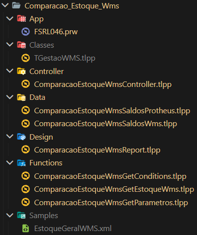
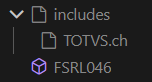

# Comparação Estoque WMS
- Nome dos namespaces: Nome da pasta
- Programa inicial na pasta App (FSRL046.prw)

## COMPONENTES
- App: Aplicação (prw)
- Controller: Maestro
- Classes: Classes, atributos e métodos
- Data: Funções para acesso a dados
- Design: Funções do geração gráfica do relatório
- Functions: Funções para terceirização de tarefas
- Samples: Arquivos e Tabelas

## Nomenclatura de variáveis
- _: local
- p: private
- s: static

## Nomenclatura dos fontes
- | : ComparacaoEstoqueWms

## ESTRUTURAS DE PASTAS

## Arquivos
### App
#### **FSRL046.prw**
- Nomenclatura:
  - FS = FORTLEV SOLAR;
  - RL = RELATÓRIO;
  - 045 = NÚMERO DELE.
- Objetivo: Ser o index da aplicação;
- Funcionamento: Executa o controller principal.
- Retorno: Vazio.

**Estrutura do fonte** 

**Funções**
- FSRL06
  - Função principal do relatório. Executa o controller Main que irá conduzir todas as operações em sequência e modularizadas.
  - Retorno: vazio

### Classes
- Namespace: Projects.WMS.ComparacaoEstoques.Classes
#### **TGestaoWMS.tlpp**
- Nomenclatura:
  - TGestaoWMS: Nome da classe.
- Objetivo: Armazenar as informações da classe TGestaoWMS (atributos e métodos);
- Funcionamento: Contém o construtor e métodos para a utilização da classe.

**Estrutura do fonte** 

**Objeto**
- TGestaoWMS
  - Objetivo: Ser um intermediador entre a aplicação e o WMS;
  - Funcionamento: Ativa, seleciona e busca informações no WMS.

**Atributos**
|            | Valor padrão | Objetivo                                           |
|------------|--------------|----------------------------------------------------|
| _oWms      | nil (nulo)   | Armazenar um objeto do tipo TWSDLManager           |
| _cWsUrl    | ""           | Representar o ndereço de conexão com o webservice  |
| _lProducao | .F.          | Informar se deve usar o endereço do Ws de produção |
| _lError    | .F.          | Informar se houve erro durante a operação          |
|            |              |                                                    |

**Métodos** 
New(_lProducao) 
| Sintaxe       | Method New(_lProducao) Class TGestaoWMS                   |
|---------------|-----------------------------------------------------------|
| Objetivo      | Instanciar um novo objeto TGestaoWMS                      |
| Funcionamento | Seta o valor dos atributos como padrão e retorna o objeto |
| Retorno       | O próprio objeto                                          |  

SelectWs(_cService) 
| Sintaxe       | Method SelectWs(_cService) Class TGestaoWMS                                     |
|---------------|---------------------------------------------------------------------------------|
| Objetivo      | Selecionar o serviço WMS adequado                                               |
| Funcionamento | Verifica se está em produção ou desenvolvimento e seleciona o endereço adequado |
| Retorno       | Vazio                                                                           |  

Activate() 
| Sintaxe       | Method Activate() Class TGestaoWMS                                   |
|---------------|----------------------------------------------------------------------|
| Objetivo      | Ativar o serviço WMS                                                 |
| Funcionamento | Cria um objeto TWSDLManager e executa métodos de ativação do serviço |
| Retorno       | _lRet (Se a conexão foi bem sucedida)                                |  

GetWsRet() 
| Sintaxe       | Method GetWsRet() Class TGestaoWMS                                       |
|---------------|--------------------------------------------------------------------------|
| Objetivo      | Solicitar e receber uma mensagem do servidor SOAP                        |
| Funcionamento | Chama um método do objeto WMS para receber uma resposta do servidor SOAP |
| Retorno       | Retorna a resposta em string do servidor                                 |  

GetError() 
| Sintaxe       | Method GetError() Class TGestaoWMS                 |
|---------------|----------------------------------------------------|
| Objetivo      | Receber a mensagem de erro (em caso)               |
| Funcionamento | Chama o atributo de mensagem de erro do objeto WMS |
| Retorno       | A mensagem de erro                                 |  

DeActivate() 
| Sintaxe       | Method DeActivate() Class TGestaoWMS                    |
|---------------|---------------------------------------------------------|
| Objetivo      | Desativar o serviço                                     |
| Funcionamento | Apaga a url de serviço e libera o objeto WMS da memória |
| Retorno       | Vazio                                                   |  

GetSaldoEstoqueGeral(_oXml) 
| Sintaxe       | Method GetSaldoEstoqueGeral(_oXml) Class TGestaoWMS                     |
|---------------|-------------------------------------------------------------------------|
| Objetivo      | Buscar o saldo do estoque geral do WMS                                  |
| Funcionamento | Seta e executa uma operação para buscar o saldo do estoque geral do WMS |
| Retorno       | _lRet (Se a operação foi bem sucedida ou não)                           |  

### Controller
- Namespace: Projects.WMS.ComparacaoEstoques.Controller
#### **ComparacaoEstoqueWmsController.tlpp**
- Nomenclatura:
  - |: Nome inicial padrão; Controller: Representa um controlador geral;
- Objetivo: Ser o maestro da aplicação, chamando as funções em sequência;
- Funcionamento: Executa sequêncialmente as funções núcleo da aplicação.

**Estrutura do fonte** 

**Imports**
- Namespace Projects.WMS.ComparacaoEstoques.Functions:
  - |GetParametros.tlpp:
    - U_SetParametros()
    - U_GetParametros()
  - |GetConditions.tlpp:
    - U_GetConditions(_aParam)
  - |GetEstoqueWms.tlpp:
    - U_GetEstoqueWms()
- Namespace Projects.WMS.ComparacaoEstoques.Design:
  - |Report.tlpp:
    - U_Design(_cAlsPrt, _cAlsWms, _aDsOrd, _bParam)
- Namespace Projects.WMS.ComparacaoEstoques.Data:
  - |SaldosProtheus.tlpp:
    - U_GetAliasSaldosProtheus()
    - U_GetDescOrdemSaldosProtheus()
    - U_SetConditionsSaldosProtheus(_aConditions)
    - U_HasWhereSaldosProtheus()
    - U_SetOrdemSaldosProtheus(_nOrdem)
    - U_RunQuerySaldosProtheus(_oSection,pcAlsWms)
  - |SaldosWms.tlpp:
    - U_GetAliasSaldosWms()

**Funções**  
Main() 
| Sintaxe       | User Function Main()                                                               |
|---------------|------------------------------------------------------------------------------------|
| Objetivo      | Controlar e organizar as ações principais da aplicação                             |
| Funcionamento | Chama as funções núcleo sequencialmente para execução e funcionamento da aplicação |
| Retorno       | Vazio                                                                              |  

Parametros() 
| Sintaxe       | User Function Parametros()                                                                                                          |
|---------------|-------------------------------------------------------------------------------------------------------------------------------------|
| Objetivo      | Receber os parâmetros e condições do relatório                                                                                      |
| Funcionamento | Se não tiver parâmetros na memória da rotina, irá chamar as respectivas funções dos módulos de obtenção das informações necessárias |
| Retorno       | _lRet (True se os parâmetros forem recebidos)                                                                                       |  

ReportPrint(_oReport as object) 
| Sintaxe       | User Function ReportPrint(_oReport as object)                                                                              |
|---------------|----------------------------------------------------------------------------------------------------------------------------|
| Objetivo      | Renderizar o relatório                                                                                                     |
| Funcionamento | Verifica se possui as informações necessárias, busca informações necessárias que faltam ao relatório e renderiza uma seção |
| Retorno       | Vazio                                                                                                                      |  

### Data
- Namespace: Projects.WMS.ComparacaoEstoques.Data
#### **ComparacaoEstoqueWmsSaldosProtheus.tlpp**
- Nomenclatura:
  - |: Nome inicial padrão; SaldosProtheus: Consulta os saldos em estoque no Protheus;
- Objetivo: Consultas os saldos em estoque do Protheus considerando o saldo;
- Funcionamento: Obtém os alias, as ordens de consulta do saldo do Protheus, além de validar as informações para execução das querys de saldo, onde o mesmo as executa.

**Estrutura do fonte** 

**Variáveis estáticas**
|              | Descrição                        | Valor padrão |
|--------------|----------------------------------|--------------|
| scAlias      | Alias dos saldos Protheus        | ""           |
| saConditions | Condições dos wheres da consulta | {}           |
| snOrdem      | Ordem da consulta                | 0            |
| saOrdem      | Conjunto de ordens da consulta   | {}           |
| saDsOrd      | Descrições das ordens            | {}           |

**Funções**  
GetAliasSaldosProtheus() 
| Sintaxe       | User Function GetAliasSaldosProtheus()                            |
|---------------|-------------------------------------------------------------------|
| Objetivo      | Pegar o alias dos saldos Protheus                                 |
| Funcionamento | Verifica se o alias estático é vazio, se for pega o próximo alias |
| Retorno       | Retorna o alias estático                                          |  

GetDescOrdemSaldosProtheus() 
| Sintaxe       | User Function GetDescOrdemSaldosProtheus()            |
|---------------|-------------------------------------------------------|
| Objetivo      | Receber a descrição das ordens de consulta            |
| Funcionamento | Se a ordem for vazia, recebe as descrições das ordens |
| Retorno       | Descrição estática das ordens                         |  

CloseQuerySaldosProtheus() 
| Sintaxe       | User Function CloseQuerySaldosProtheus()                  |
|---------------|-----------------------------------------------------------|
| Objetivo      | Fechar as conexões ativas com o alias dos Saldos Protheus |
| Funcionamento | Se houverem conexões ativas, irá fechá-las                |
| Retorno       | Vazio                                                     |  

SetConditionsSaldosProtheus(_aConditions as array) 
| Sintaxe       | User Function SetConditionsSaldosProtheus(_aConditions as array) |
|---------------|------------------------------------------------------------------|
| Objetivo      | Atribui às condições estática uma condição recebida              |
| Funcionamento | Atribui o valor recebida à variável estática das condições       |
| Retorno       | Vazio                                                            |  

HasWhereSaldosProtheus() 
| Sintaxe       | User Function HasWhereSaldosProtheus()                                    |
|---------------|---------------------------------------------------------------------------|
| Objetivo      | Ver se tem alguma condição na variável estática de condições              |
| Funcionamento | Se o tamanho do array de condições for maior que zero, retorna verdadeiro |
| Retorno       | _lWhere (Verdadeiro se tiverem condições em memória)                      |  

SetOrdemSaldosProtheus(_nOrdem as numeric) 
| Sintaxe       | User Function SetOrdemSaldosProtheus(_nOrdem as numeric) |
|---------------|----------------------------------------------------------|
| Objetivo      | Atribuir à ordem estática a ordem recebida               |
| Funcionamento | Atribui à ordem estática a ordem recebida                |
| Retorno       | Vazio                                                    |  

RunQuerySaldosProtheus(_oSection as object, _cAlsWms as character) 
| Sintaxe       | User Function RunQuerySaldosProtheus(_oSection as object, _cAlsWms as character)                                                                                                 |
|---------------|----------------------------------------------------------------------------------------------------------------------------------------------------------------------------------|
| Objetivo      | Rodar uma consulta utilizando as condições (wheres e havings) e ordens armazenadas, com o Alias do Protheus e do Wms                                                             |
| Funcionamento | Pega os valores estáticas com as informações dos havings e wheres, pega os alias, roda um SQL e injeta as informações, finaliza a query na seção do formulário e reseta o alias  |
| Retorno       | _lRet (Se ainda tem registros)                                                                                                                                                   |  

#### **ComparacaoEstoqueWmsSaldosWms.tlpp**
- Nomenclatura:
  - |: Nome inicial padrão; SaldosWms: Consulta os saldos em estoque no WMS;
- Objetivo: Consultas os saldos em estoque do WMS considerando o saldo;
- Funcionamento: Obtém os alias do WMS, prepara uma tabela temporária para os dados do WMS e deleta a tabela, se for requisitado.

**Estrutura do fonte** 

**Variáveis estáticas**
|             | Descrição                                   | Valor padrão |
|-------------|---------------------------------------------|--------------|
| soTempTable | Objeto tabela temporária (FWTemporaryTable) | nil (nulo)   |
| scAliasTRB  | Alias TRB                                   | ""           |

**Funções**  
GetAliasSaldosWms() 
| Sintaxe       | User Function GetAliasSaldosWms()                                            |
|---------------|------------------------------------------------------------------------------|
| Objetivo      | Pegar o Alias TRB                                                            |
| Funcionamento | Seta o Alias se não estiver em memória ou tabela temporária não criada ainda |
| Retorno       | _cAlias (Alias TRB estático)                                                 |  

DelTempTableWms() 
| Sintaxe       | User Function DelTempTableWms()                                                 |
|---------------|---------------------------------------------------------------------------------|
| Objetivo      | Deletar a tabela temporária WMS                                                 |
| Funcionamento | Fecha a área do Alias, deleta a tabela temporária de deleta o objeto da memória |
| Retorno       | Vazio                                                                           |  

UpdSaldoWms(_oXml as object) 
| Sintaxe       | User Function UpdSaldoWms(_oXml as object)                                                                    |
|---------------|---------------------------------------------------------------------------------------------------------------|
| Objetivo      | Atualiza os dados do Alias com as informações do XML                                                          |
| Funcionamento | Pega os itens no XML, e em loop trava o registro do Alias e insere as novas informações. Depois trava o mesmo |
| Retorno       | Vazio                                                                                                         |  

fSetTemporaryTable() 
| Sintaxe       | Static Function fSetTemporaryTable()                                                  |
|---------------|---------------------------------------------------------------------------------------|
| Objetivo      | Setar e criar a tabela temporária                                                     |
| Funcionamento | Pega o Alias TRB, seta os campos e cria uma tabela temporária para armazenar os dados |
| Retorno       | Vazio                                                                                 |  

### Design
- Namespace: Projects.WMS.ComparacaoEstoques.Design
#### **ComparacaoEstoqueWmsReport.tlpp**
- Nomenclatura:
  - |: Nome inicial padrão; Design: Responsável pela parte gráfica do relatório, utitlizando TReport;
- Objetivo: Setar as informações do relatório e renderizá-lo;
- Funcionamento: .

**Estrutura do fonte** 

**Funções**  
Design(_cAlsPrt as character, _cAlsWms as character, _aDsOrd as array, _bParam as codeblock) 
| Sintaxe       | User Function Design(_cAlsPrt as character, _cAlsWms as character, _aDsOrd as array, _bParam as codeblock)                      |
|---------------|---------------------------------------------------------------------------------------------------------------------------------|
| Objetivo      | Recebe os parâmetros gerais do relatório e renderiza o relatório                                                                |
| Funcionamento | Seta as variáveis de parâmetros pro relatório com as informações recebida, define o mesmo com a função de definição e renderiza |
| Retorno       | .T.                                                                                                                             |  

ReportDef() 
| Sintaxe       | Static Function ReportDef()                                                                    |
|---------------|------------------------------------------------------------------------------------------------|
| Objetivo      | Setar e aplicar as definições do relatório                                                     |
| Funcionamento | Cria o objeto relatório TReport, define características visuais e estruturais (seção e campos) |
| Retorno       | _oReport (o objeto relatório TReport)                                                          |  

### Functions
- Namespace: Projects.WMS.ComparacaoEstoques.Functions
#### **ComparacaoEstoqueWmsGetConditions.tlpp**
- Nomenclatura:
  - |: Nome inicial padrão; GetConditions: Monta as cláusulas Where e Havings necessárias para a consulta;
- Objetivo: Montar as cláusulas Where e Havings necessárias para a consulta
- Funcionamento: Recebe arrays de parâmetros e pode gerar clausulas Where e Having para condições específicas baseadas nos parâmetros recebidos.

**Estrutura do fonte** 

**Funções**  
User Function GetConditions(_aParam as array) 
| Sintaxe       | GetConditions(_aParam as array)                                                                            |
|---------------|------------------------------------------------------------------------------------------------------------|
| Objetivo      | Gerar wheres com as informações dos parâmetros das perguntas                                               |
| Funcionamento | Cria um array de condições e adiciona no mesmo várias string concatenadas com as informações das perguntas |
| Retorno       | _aConditions (array de condições)                                                                          |  

fGetHavingDiferencas(_aParam as array) 
| Sintaxe       | Static Function fGetHavingDiferencas(_aParam as array)                                             |
|---------------|----------------------------------------------------------------------------------------------------|
| Objetivo      | Gerar um having com as informações dos parâmetros das perguntas (diferença entre dois valores)     |
| Funcionamento | Cria uma string having e adiciona no mesmo uma string concatenada com as informações das perguntas |
| Retorno       | _cHavingDiferencas                                                                                 |  

fGetWhereAvarias(_aParam as array) 
| Sintaxe       | Static Function fGetWhereAvarias(_aParam as array)                                                                                       |
|---------------|------------------------------------------------------------------------------------------------------------------------------------------|
| Objetivo      | Gerar wheres com as informações dos parâmetros das perguntas referentes às avarias                                                       |
| Funcionamento | Pega uma lista de avarias do arquivo SX6, e se o usuário solicitou o where de avarias, cria um where se o registro está contido na lista |
| Retorno       | _aWhereAvarias (array de condições where das avarias)                                                                                    |  

#### **ComparacaoEstoqueWmsGetEstoqueWms.tlpp**
- Nomenclatura:
  - |: Nome inicial padrão; GetEstoqueWms: Pegar o estoque WMS;
- Objetivo: Manipular e receber os dados obtidos do WMS;
- Funcionamento: Cria um objeto de gestão do WMS, o ativa, pega o saldo do estoque WMS, desativa o objeto, atualiza o saldo do estoque no banco e deleta o objeto.

**Estrutura do fonte** 

**Imports**
- Namespace Projects.WMS.ComparacaoEstoques.Classes:
  - TGestaoWMS.tlpp:
    - Class TGestaoWMS
- Namespace Projects.WMS.ComparacaoEstoques.Data:
  - |SaldosWms.tlpp:
    - U_UpdSaldoWms(_oXml)

**Funções**  
GetEstoqueWms() 
| Sintaxe       | User Function GetEstoqueWms()                                                                                                                                               |
|---------------|-----------------------------------------------------------------------------------------------------------------------------------------------------------------------------|
| Objetivo      | Manipular e receber os dados obtidos do WMS;                                                                                                                                |
| Funcionamento | Cria um objeto de gestão do WMS, o ativa, pega o saldo do estoque WMS, desativa o objeto, se o saldo não for vazio, atualiza o saldo do estoque no banco e deleta o objeto. |
| Retorno       | _lRet (Falso)                                                                                                                                                               |  

#### **ComparacaoEstoqueWmsGetParametrostlpp**
- Nomenclatura:
  - |: Nome inicial padrão; GetParametros: Pegar os parâmetros;
- Objetivo: Setar e pegar os parâmetros das perguntas;
- Funcionamento: Seta os campos das perguntas e armazena em um array, pega os parâmetros da variável estática e passa para a função que chamou e separa as funções da Combo Box.

**Estrutura do fonte** 

**Variáveis estáticas**
|         | Descrição                         | Valor padrão |
|---------|-----------------------------------|--------------|
| saParam | Array de respostas dos parâmetros | {}           |

**Funções**  
SetParametros() 
| Sintaxe       | User Function SetParametros()                                                                          |
|---------------|--------------------------------------------------------------------------------------------------------|
| Objetivo      | Setar o conjunto de parâmetros a serem perguntados ao usuário antes de gerar o relatório               |
| Funcionamento | Gera o conjunto de campos dos parâmetros para pergunta em um array e armazena as respostas em um array |
| Retorno       | _lRet (Falso se as respostas não foram passadas)                                                       |  

GetParametros() 
| Sintaxe       | User Function GetParametros()                                                                         |
|---------------|-------------------------------------------------------------------------------------------------------|
| Objetivo      | Pegar os parâmetros estáticos                                                                         |
| Funcionamento | Atribui a uma variável que será retornada o valor que está armazenando no array de respostas estático |
| Retorno       | _aParam (array de respostas)                                                                          |  

fGetComboOption(xOpc as variant, aComboBx as array) 
| Sintaxe       | Static Function fGetComboOption(xOpc as variant, aComboBx as array)                                              |
|---------------|------------------------------------------------------------------------------------------------------------------|
| Objetivo      | Pegar um valor padronizado para as repostas da combo box                                                         |
| Funcionamento | Se a opção passa estiver na Combo Box, retorna o index dela no array de respostas, caso contrário retornará nulo |
| Retorno       | nOption (Opção em número ou nulo)                                                                                |  

## Estrutura da Aplicação

## Funções externas
### MSAguarde
| Nome       | MSAguarde( bAcao, cTitulo ,cMensagem, lAbortar)                                                                                                                                                                                       |
|------------|--------------------------------------------------------------------------------------------------------------------------------------------------------------------------------------------------------------------------------------|
| Parâmetros | bAcao = Bloco de código que será executado; cTitulo = Título da tela de processamento; cMensagem = Mensagem que será exibida durante o processamento; lAborta = .T. habilita o botão Cancelar, .F. desabilita o botão (opção padrão) |
| Descrição  | Monta tela de processamento para múltiplas mensagens, na teoria o botão cancelar que aparece deveria funcionar a qualquer momento, mas só na função User principal                                                                   |
| Retorno    | Sem retorno                                                                                                                                                                                                                          | 
### FormatIn
| Nome       | FormatIn(cString, cSep)                                                       |
|------------|-------------------------------------------------------------------------------|
| Parâmetros | cString: String inicial; cSep: Caracter separador                             |
| Descrição  | Formatar uma string para ser utilizada dentro do operador IN no ambiente SQL. |
| Retorno    | String formatada                                                              | 

###  SuperGetMV
| Nome       | SuperGetMV(cNomeParametro, lAjuda, cPadrão, cFilial)                                                                                                                                                                                                                                                                                                                                                                                               |
|------------|----------------------------------------------------------------------------------------------------------------------------------------------------------------------------------------------------------------------------------------------------------------------------------------------------------------------------------------------------------------------------------------------------------------------------------------------------|
| Parâmetros | cNomeParametro: Nome do parâmetro do sistema no Arquivo SX6, sem a especificação da filial do sistema Protheus; lAjuda: Define se a mensagem de ajuda será exibida caso o parâmetro não seja encontrado no Arquivo SX6 ; cPadrão: Conteúdo padrão que será utilizado caso o parâmetro não exista no Arquivo SX6; Define em qual filial será realizada a consulta do parâmetro no Arquivo SX6. O padrão é a filial corrente da conexão ao Protheus. |
| Descrição  | Retorna o conteúdo do parâmetro especificado no Arquivo SX6                                                                                                                                                                                                                                                                                                                                                                                        |
| Retorno    | Lista de Itens                                                                                                                                                                                                                                                                                                                                                                                                                                     | 
### Sleep
| Nome       | Sleep(nSegundos)                                                                                                         |
|------------|--------------------------------------------------------------------------------------------------------------------------|
| Parâmetros | nSegundos: Quantidade de segundos de pausa                                                                               |
| Descrição  | Tem o objetivo de fazer com que a thread corrente deixe de ser executada de acordo com o valor informado como parâmetro. |
| Retorno    | Sem retorno                                                                                                              | 
### FreeObj
| Nome       | FreeObj(oObj)               |
|------------|-----------------------------|
| Parâmetros | oObj Objeto                 |
| Descrição  | Elimina o objeto da memória |
| Retorno    | Sem retorno                 | 
### PadR
| Nome       | PadR(xExp,nLen,cFill)                                                                                                                                                                                                    |
|------------|--------------------------------------------------------------------------------------------------------------------------------------------------------------------------------------------------------------------------|
| Parâmetros | xExp: Indica um valor no qual serão inseridos caracteres de preenchimento. (OBRIGRATÓRIO); nLen: Indica o tamanho da string que será retornada. (OBRIGATÓRIO); cFill: Indica o caractere que será inserido no parâmetro. |
| Descrição  | Adiciona caracteres de preenchimento à direita do conteúdo de uma variável                                                                                                                                               |
| Retorno    | String formatada                                                                                                                                                                                                           | 
### PadL
| Nome       | PadR(xExp,nLen,cFill)                                                                                                                                                                                                    |
|------------|--------------------------------------------------------------------------------------------------------------------------------------------------------------------------------------------------------------------------|
| Parâmetros | xExp: Indica um valor no qual serão inseridos caracteres de preenchimento. (OBRIGRATÓRIO); nLen: Indica o tamanho da string que será retornada. (OBRIGATÓRIO); cFill: Indica o caractere que será inserido no parâmetro. |
| Descrição  | Adiciona caracteres de preenchimento à esquerda do conteúdo de uma variável                                                                                                                                              |
| Retorno    | String formatada                                                                                                                                                                                                         | 
### ParamBox
| Nome       | ParamBox(aParametros, cTitle, aRet, bOk, aButtons,lCentered, nPosX, nPosY, oDlgWizard, cLoad, CanSave, lUserSave) |
|------------|-------------------------------------------------------------------------------------------------------------------|
| Parâmetros | 1- Vetor com as configurações                                                                                     |
|            | 2 - Título da janela                                                                                              |
|            | 3 - Vetor passador por referencia que contém o retorno dos parâmetros                                             |
|            | 4 - Code block para validar o botão Ok                                                                            |
|            | 5 - Vetor com mais botões além dos botões de Ok e Cancel                                                          |
|            | 6 - Centralizar a janela                                                                                          |
|            | 7 - Se não centralizar janela coordenada X para início                                                            |
|            | 8 - Se não centralizar janela coordenada Y para início                                                            |
|            | 9 - Utiliza o objeto da janela ativa                                                                              |
|            | 10 - Nome do perfil se caso for carregar                                                                          |
|            | 11 - Salvar os dados informados nos parâmetros por perfil                                                         |
|            | 12 - Configuração por usuário                                                                                     |
| Descrição  | A função ParamBox cria uma tela de interação com usuário com os parâmetros passado pra ela como array.            |
| Retorno    | Objeto ParamBox renderizado na tela                                                                               | 
### AClone
| Nome       | ACLONE(aArray)                                                                  |
|------------|---------------------------------------------------------------------------------|
| Parâmetros | aArray: Array                                                                   |
| Descrição  | A função ACLONE() duplica um array de uma ou mais dimensões (multidimensional). |
| Retorno    | Array Clonado                                                                   | 
### ValType
| Nome       | ValType(xOpc)              |
|------------|----------------------------|
| Parâmetros | xOpc: qualquer variável    |
| Descrição  | Retorna o tipo da variável |
| Retorno    | A = ARRAY                  |
|            | C = CARACTER               |
|            | D = DATA                   |
|            | L = LÓGICO                 |
|            | M = CAMPO MEMO      |
|            | N = NÚMERICO               |
|            | O = OBJETO                 |
|            | U = NULO                   | 
### Empty
| Nome       | Empty(xVar)                      |
|------------|----------------------------------|
| Parâmetros | xVar: Variável                   |
| Descrição  | Retorna se a variável está vazia |
| Retorno    | .T. ou .F.                       | 
### Len
| Nome       | Len(aArray)                |
|------------|----------------------------|
| Parâmetros | aAraay: array              |
| Descrição  | Retorna o tamanho do array |
| Retorno    | Número inteiro             | 
### AllTrim
| Nome       | AllTrim(cCaractere)                                                                            |
|------------|------------------------------------------------------------------------------------------------|
| Parâmetros | cCaractere: Texto a ser alterado                                                               |
| Descrição  | Remove os espaços em branco do início e fim de uma cadeia de caracteres passada como parâmetro |
| Retorno    | Texto sem os espaços em branco                                                                 | 
### StrTran
| Nome       | StrTran(cString, cProcura, cSubstitui, nInício, nCont)                            |
|------------|-----------------------------------------------------------------------------------|
| Parâmetros | cCaractere: Texto a ser alterado                                                  |
| Descrição  | StrTran pesquisa e substitui caracteres de uma cadeia de caracteres ou campo memo |
| Retorno    | Texto com os caracteres substituídos                                              |

## Objetos
### TReport
- Relatório 
- https://tdn.totvs.com/display/public/framework/TReport 

**Métodos**
| Nome       | New( cReport , cTitle , uParam , bAction , cDescription , lLandscape , uTotalText, lTotalInLine , cPageTText , lPageTInLine , lTPageBreak , nColSpace ) |
|------------|---------------------------------------------------------------------------------------------------------------------------------------------------------|
| Parâmetros | cTitle: Título do relatório                                                                                                                             |
|            | uParam: Parâmetros do relatório cadastrado no Dicionário de Perguntas (SX1). Também pode ser utilizado bloco de código para parâmetros customizados     |
|            | bAction: Bloco de código que será executado quando o usuário confirmar a impressão do relatório                                                         |
|            | cDescription: Descrição do relatório                                                                                                                    |
|            | lLandscape: Aponta a orientação de página do relatório como paisagem                                                                                    |
|            | uTotalText: (Caracter / Bloco de Código) Texto do totalizador do relatório, podendo ser caracter ou bloco de código                                     |
|            | lTotalInLine: Imprime as células em linha                                                                                                               |
|            | cPageTText: Texto do totalizador da página                                                                                                              |
|            | lPageTInLine: Imprime totalizador da página em linha                                                                                                    |
|            | lTPageBreak: Quebra página após a impressão do totalizador                                                                                              |
|            | nColSpace: Espaçamento entre as colunas                                                                                                                 |
| Descrição  | Método construtor da classe TReport                                                                                                                     |
| Retorno    | Objeto TReport                                                                                                                                          | 

| Nome       | SetLandscape( )                                          |
|------------|----------------------------------------------------------|
| Parâmetros | Sem parâmetros                                           |
| Descrição  | Define a orientação de página do relatório como Paisagem |
| Retorno    | Sem retorno                                              | 

| Nome       | SetDynamic()                                                                                                                |
|------------|-----------------------------------------------------------------------------------------------------------------------------|
| Parâmetros | Sem parâmetros                                                                                                              |
| Descrição  | Define que o relatório será do tipo dinâmico, no qual, permite imprimir as seções conforme a ordem de impressão selecionada |
| Retorno    | Sem retorno                                                                                                                 | 

| Nome       | ShowParamPage( )                                             |
|------------|--------------------------------------------------------------|
| Parâmetros | Sem parâmetros                                               |
| Descrição  | Define que será impressa a página de parâmetros do relatório |
| Retorno    | Sem retorno                                                  | 

| Nome       | PrintDialog()                                                                                 |
|------------|-----------------------------------------------------------------------------------------------|
| Parâmetros | Sem parâmetros                                                                                |
| Descrição  | bAction: Bloco de código que será executado quando usuário confirmar a impressão do relatório |
| Retorno    | lRet                                                                                          | 

| Nome       | Section(uSection)                                         |
|------------|-----------------------------------------------------------|
| Parâmetros | uSection: (caracter ou numérico) Título da seção ou index |
| Descrição  | Retorna objeto da classe TRSection (seção)                |
| Retorno    | Objeto TRSection                                          | 

| Nome       | GetOrder( )                              |
|------------|------------------------------------------|
| Parâmetros | Sem parâmetros                           |
| Descrição  | Retorna a ordem de impressão selecionada |
| Retorno    | nRet - Ordem selecionada                 | 

**Atributos**
| Atributo   | Descrição                              |
|------------|----------------------------------------|
| lParamPage | Se deve mostrar a página de parâmetros |
|            |                                        | 

### TRSection
- Seção do relatório 
- https://tdn.totvs.com/display/public/framework/TRSection 

**Métodos** 
| Nome       | New( oParent, cTitle, uTable, aOrder, lLoadCells, lLoadOrder, uTotalText, lTotalInLine, lHeaderPage, lHeaderBreak, lPageBreak, lLineBreak, nLeftMargin, lLineStyle, nColSpace, lAutoSize, cCharSeparator, nLinesBefore, nCols, nClrBack, nClrFore, nPercentage) |
|------------|-----------------------------------------------------------------------------------------------------------------------------------------------------------------------------------------------------------------------------------------------------------------|
| Parâmetros | oParent: Objeto da classe TReport ou TRSection que será o pai da classe TRSection (OBRIGATÓRIO)                                                                                                                                                                 |
| Descrição  | cTitle: Título da seção                                                                                                                                                                                                                                         |
| Retorno    | uTable: Caracter / Array; Tipo Caracter: Tabela que sera utilizada pela seção; Tipo Array: Lista de tabelas que serão utilizadas pela seção                                                                                                                     |
|            | aOrder: Array contendo a descrição das ordens. Elemento: 1-Descrição, como por exemplo, Filial+Código                                                                                                                                                           |
|            | lLoadCells: Carrega os campos do Dicionário de Campos (SX3) das tabelas da seção como células                                                                                                                                                                   |
|            | lLoadOrder: Carrega os índices do Dicionário de Índices (SIX)                                                                                                                                                                                                   |
|            | uTotalText: Caracter / Bloco de Código; Texto do totalizador da seção, podendo ser caracter ou bloco de código                                                                                                                                                  |
|            | lTotalInLine: Imprime as células em linha                                                                                                                                                                                                                       |
|            | lHeaderPage: Cabeçalho da seção no topo da página                                                                                                                                                                                                               |
|            | lHeaderBreak: Imprime cabeçalho na quebra da seção                                                                                                                                                                                                              |
|            | lPageBreak: Imprime cabeçalho da seção na quebra de página                                                                                                                                                                                                      |
|            | lLineBreak: Quebra a linha na impressão quando as informações não couberem na página                                                                                                                                                                            |
|            | nLeftMargin: Tamanho da margem à esquerda da seção                                                                                                                                                                                                              |
|            | lLineStyle: Imprime a seção em linha                                                                                                                                                                                                                            |
|            | nColSpace: Espaçamento entre as colunas                                                                                                                                                                                                                         |
|            | lAutoSize: Ajusta o tamanho das células para que caiba emu ma página                                                                                                                                                                                            |
|            | cCharSeparator: Define o caracter que separa as informações na impressão em linha                                                                                                                                                                               |
|            | nLinesBefore: Aponta a quantidade de linhas a serem saltadas antes da impressão da seção                                                                                                                                                                        |
|            | nCols: Quantidade de colunas a serem impressas                                                                                                                                                                                                                  |
|            | nClrBack: Cor de fundo das células da seção                                                                                                                                                                                                                     |
|            | nClrFore: Cor da fonte das células da seção                                                                                                                                                                                                                     |
|            | nPercentage: Tamanho da página a ser considerada na impressão em percentual                                                                                                                                                                                     |
| Descrição  | Método construtor da classe TRSection                                                                                                                                                                                                                           |
| Retorno    | Objeto TRSection                                                                                                                                                                                                                                                | 

| Nome       | Print(lFromParent)                                                                                                                                                                                                                                                                                                                                                                                                       |
|------------|--------------------------------------------------------------------------------------------------------------------------------------------------------------------------------------------------------------------------------------------------------------------------------------------------------------------------------------------------------------------------------------------------------------------------|
| Parâmetros | lFromParent: Aponta que é impressão de uma seção filha                                                                                                                                                                                                                                                                                                                                                                   |
| Descrição  | Realiza a impressão baseada na tabela ou query principal, executando o método PrintLine para cada linha e o método Print de todas as seções filhas. Nas seções filhas, o posicionamento inicial pode ser baseado na query da seção pai (através do método SetParentQuery) ou através da regra informada pelo método SetRelation, junto com a regra informada pelo método SetParentFilter que controla o fim da impressão |
| Retorno    | oRet (objeto de retorno)                                                                                                                                                                                                                                                                                                                                                                                                 | 

| Nome       | BeginQuery( )                                                                   |
|------------|---------------------------------------------------------------------------------|
| Parâmetros | Sem parâmetros                                                                  |
| Descrição  | Indica que será utilizado o Embedded SQL para criação de uma query para a seção |
| Retorno    | Sem retorno                                                                     | 

| Nome       | EndQuery(aParam)                                                                                                                                                                                                                                                                                                                                                                                                                                                                      |
|------------|---------------------------------------------------------------------------------------------------------------------------------------------------------------------------------------------------------------------------------------------------------------------------------------------------------------------------------------------------------------------------------------------------------------------------------------------------------------------------------------|
| Parâmetros | aParam: Tipo Caracter: Pergunta. Exemplo: mv_par01 do tipo Range; Tipo Array: Lista de perguntas. Exemplo: {mv_par01, mv_par02} do tipo Range                                                                                                                                                                                                                                                                                                                                         |
| Descrição  | Indica a query criada utilizando o Embedded SQL para a seção. O método EndQuery irá juntar na query as células selecionadas e o filtro criado pelo usuário, mais a expressão das perguntas do tipo Range, que foram convertidas anteriormente pela função MakeSQLExpr. Após sua execução, a query esta pronta para ser utilizada tanto pela classe TRSection como para o programa que esta criando os componentes, sem a necessidade de utilizar TCGenQuery, ChangeQuery e TCSetField |
| Retorno    | Sem retorno                                                                                                                                                                                                                                                                                                                                                                                                                                                                           | 

### TRCell
- Célula da seção 
- https://tdn.totvs.com/display/public/framework/TRCell

**Métodos**
| Nome       | New(oParent, cName, cAlias, cTitle, cPicture, nSize, lPixel, bBlock, cAlign, lLineBreak, cHeaderAlign, lCellBreak, nColSpace, lAutoSize, nClrBack, nClrFore, lBold) |
|------------|---------------------------------------------------------------------------------------------------------------------------------------------------------------------|
| Parâmetros | oParent: Objeto da classe TRSection que a célula pertence                                                                                                           |
|            | cName: Nome da célula                                                                                                                                               |
|            | cAlias: Tabela utilizada pela célula                                                                                                                                |
|            | cTitle: Título da célula                                                                                                                                            |
|            | cPicture: Mascara da célula                                                                                                                                         |
|            | nSize: Tamanho da célula                                                                                                                                            |
|            | lPixel: Aponta se o tamanho foi informado em pixel                                                                                                                  |
|            | bBlock: Bloco de código com o retorno do campo                                                                                                                      |
|            | cAlign: Alinhamento da célula. “LEFT”, “RIGHT” e “CENTER”                                                                                                           |
|            | lLineBreak: Quebra linha se o conteúdo estourar o tamanho do campo                                                                                                  |
|            | cHeaderAlign: Alinhamento do cabeçalho da célula. “LEFT”, “RIGHT” e “CENTER”                                                                                        |
|            | lCellBreak: Compatibilidade – Não utilizado                                                                                                                         |
|            | nColSpace: Espaçamento entre as células                                                                                                                             |
|            | lAutoSize: Ajusta o tamanho da célula com base no tamanho da página e as informações impressas                                                                      |
|            | nClrBack: Cor de fundo da célula                                                                                                                                    |
|            | nClrFore: Cor da fonte da célula                                                                                                                                    |
|            | lBold: Imprime a fonte em negrito                                                                                                                                   |
| Descrição  | Método construtor da classe TRCell                                                                                                                                  |
| Retorno    | Objeto célula                                                                                                                                                       |

